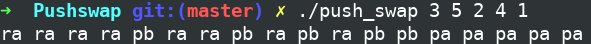

# Pushswap

{EPITECH} The goal of this project is to make a program to sort a number list, by using the fewest possible operations.

## OPERATIONS

You can use two list for this project, ```l_a``` and ```l_b```.
The operations that you can use are following :
* ```sa``` : swap the first two elements of ```l_a``` (nothing will happen if there aren’t enough elements).
* ```sb``` : swap the first two elements of ```l_b``` (nothing will happen if there aren’t enough elements).
* ```sc``` : ```sa``` and ```sb``` at the same time.
* ```pa``` : take the first element from ```l_b``` and move it to the first position of ```l_a``` (nothing will happen if ```l_b``` is empty).
* ```pb``` : take the first element from ```l_a``` and move it to the first position of ```l_b``` (nothing will happen if ```l_a``` is empty).
* ```ra``` : rotate ```l_a``` toward the beginning, the first element will become the last.
* ```rb``` : rotate ```l_b``` toward the beginning, the first element will become the last.
* ```rr``` : ```ra``` and ```rb```at the same time.
* ```rra``` : rotate ```l_a``` toward the end, the last element will become the first.
* ```rrb``` : rotate ```l_b``` toward the end, the last element will become the first.
* ```rrr``` : ```rra``` and ```rrb``` at the same time.

## HOW TO USE

### REQUIREMENTS

* [GCC](https://gcc.gnu.org/)
* [Make](https://www.gnu.org/software/make/)

### USAGES

Compilation

```
$>  Make
```

Execution

```
$>  ./pushswap 2 15 3 7 35 19 .....
```

## SCREENSHOTS



## DEVELOPMENT

* [C](https://fr.wikipedia.org/wiki/C_(langage))

## AUTHOR

* **Seifdine BARGUI** - ([Github](https://github.com/SeifdineB) / [LinkedIn](https://www.linkedin.com/in/seifdine))
